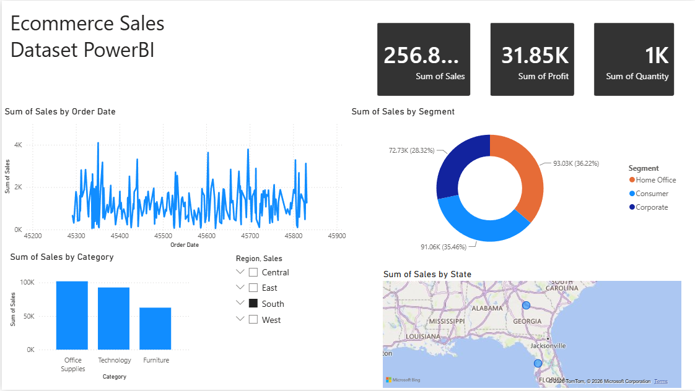

#  E-Commerce Sales Dashboard | Power BI

## 📊 Dashboard Preview

##  Project Overview

This project is an interactive **Power BI Dashboard** developed to analyze E-Commerce sales data and provide meaningful business insights. It helps visualize sales performance, profitability, customer segments, regional trends, and product performance through interactive charts and KPIs.

---

##  Features

-  YTD Sales Analysis
-  Profit Analysis
-  Quantity Sold
-  Profit Margin
-  Bottom 5 Products
-  Regional Sales Distribution
-  Shipping Mode Analysis
-  State-wise Sales Map
-  Interactive Slicers

---

##  Tools & Technologies

- Microsoft Power BI
- DAX (Data Analysis Expressions)
- Power Query
- Data Modeling
- Microsoft Excel

---

##  Dataset

The project uses a sample E-Commerce Sales dataset containing:

- Order Date
- Ship Date
- Region
- State
- City
- Segment
- Category
- Sub Category
- Product Name
- Sales
- Profit
- Quantity
- Ship Mode

---

## 📈 KPIs

- Total Sales
- Total Profit
- Total Quantity
- Profit Margin
- YTD Sales
- YTD Profit
- YTD Quantity

---

##  Project Structure

E-Commerce-Sales-Dashboard-PowerBI/
│
├── Dashboard.pbix
├── Dataset.xlsx
├── Images/
│   └── Dashboard.png
├── README.md
└── LICENSE

##💡 Business Insights

- Identify best-selling products.
- Analyze regional sales performance.
- Track profit margin.
- Monitor customer segments.
- Evaluate shipping methods.
- Support business decision-making.

---

⭐ If you found this project useful, please give it a Star.
